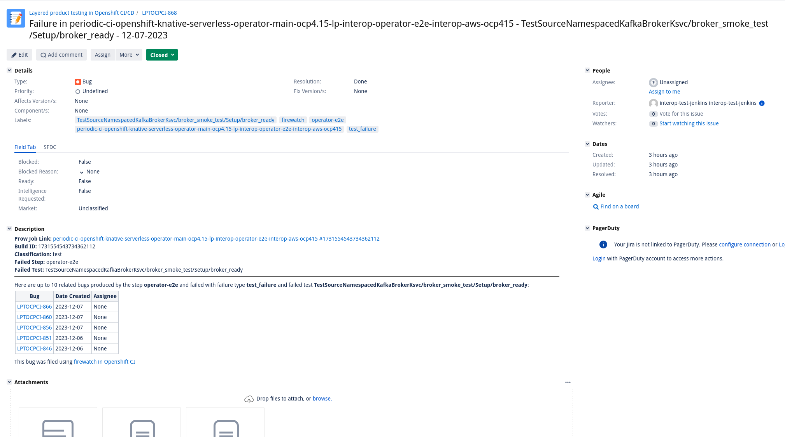

# Using the firewatch CLI

## Table of Contents

* [Using the firewatch CLI](#using-the-firewatch-cli)
  * [Installation](#installation)
    * [Docker (recommended)](#docker-recommended)
    * [Local Machine (using venv)](#local-machine-using-venv)
  * [Configuration](#configuration)
  * [Usage](#usage)
    * [`report`](#report)
    * [`jira-config-gen`](#jiraconfiggen)
    * [`gitleaks`](#gitleaks)

## Installation

### Docker (recommended)

1. Ensure you have [Docker installed](https://www.docker.com/get-started/) on your system.
2. Clone the repository: `git clone https://github.com/CSPI-QE/firewatch.git`.
3. Navigate to the project root in your terminal: `cd firewatch`.
4. Run the following to build and run a Docker container with firewatch installed: `make build-run`.
5. Use the `firewatch` command to execute the tool. See the [CLI usage guide](docs/cli_usage_guide.md) for instructions on using the tool.

### Local Machine (using venv)

1. Clone the repository: `git clone https://github.com/CSPI-QE/firewatch.git`
2. Navigate to the project root: `cd firewatch`
3. Install the necessary dependencies: `make dev-environment`
4. Use the `firewatch` command to execute the tool. See the [CLI usage guide](docs/cli_usage_guide.md) for instructions on using the tool.

## Configuration

Please see the [configuration guide](configuration_guide.md) to help you build your configuration.

## Usage

### `report`

The `report` command is used to generate and file Jira issues for a failed OpenShift CI run using a [user-defined firewatch configuration](#configuration).
Many of the arguments for this command have set defaults or will use an environment variable.

**Pre-requisites:**

1. A Jira configuration file must exist. Use the `jira-config-gen` command to generate the configuration file.
2. A firewatch config must be defined. Use the [Configuration section above](#configuration) to generate your configuration.

**Arguments:**

```commandline
Usage: firewatch report [OPTIONS]

Options:
  --gitleaks                      If set, firewatch will perform a gitleaks
                                  detect scan on the job directory
                                  (/tmp/12345) that is created to hold logs
                                  and results for a job following execution.
  --verbose-test-failure-reporting-ticket-limit INTEGER
                                  Used to limit the number of bugs created
                                  when --verbose-test-reporting is set. If not
                                  specified, the default limit is 10.
  --verbose-test-failure-reporting
                                  If set, firewatch will report a bug for each
                                  test failure found.
  --keep-job-dir                  If set, firewatch will not delete the job
                                  directory (/tmp/12345) that is created to
                                  hold logs and results for a job following
                                  execution.
  --fail-with-test-failures       Firewatch will fail with a non-zero exit
                                  code if a test failure is found.
  --jira-config-path PATH         The path to the jira configuration file
  --firewatch-config-path PATH    The path to the firewatch configuration file
  --gcs-bucket TEXT               The name of the GCS bucket that holds
                                  OpenShift CI logs
  --build-id TEXT                 The build ID that needs to be reported. The
                                  value of $BUILD_ID
  --job-name-safe TEXT            The safe name of a test in a Prow job. The
                                  value of $JOB_NAME_SAFE
  --job-name TEXT                 The full name of a Prow job. The value of
                                  $JOB_NAME
  --help                          Show this message and exit.```

**Examples:**

```commandline
# Using all environment variables (Running in OpenShift CI uses this method)
$ export BUILD_ID="some_build_id"
$ export JOB_NAME_SAFE="some_safe_job_name"
$ export JOB_NAME="some_job_name"
$ export FIREWATCH_DEFAULT_JIRA_PROJECT="PROJECT"

# OPTIONAL DEFAULTS
# $ export FIREWATCH_DEFAULT_JIRA_EPIC="PROJECT-123"
# $ export FIREWATCH_DEFAULT_JIRA_COMPONENT='["default-component"]'
# $ export FIREWATCH_DEFAULT_JIRA_AFFECTS_VERSION="4.14"
# $ export FIREWATCH_DEFAULT_JIRA_ADDITIONAL_LABELS='["default-label"]'
# $ export FIREWATCH_DEFAULT_JIRA_ASSIGNEE="some-user@redhat"
# $ export FIREWATCH_DEFAULT_JIRA_PRIORITY="major"
# $ export FIREWATCH_DEFAULT_JIRA_SECURITY_LEVEL="some-security-level"

$ export FIREWATCH_CONFIG="[{"step": "some-step-name","failure_type":"pod_failure", "classification": "some best guess classification", "jira_project": "PROJECT"}]"
$ firewatch report

# Using CLI arguments
$ firewatch report --build-id some_build_id --job-name-safe some_safe_job_name --job_name some_job_name --firewatch-config-path /some/path/to/firewatch_config.json

# Exit with a non-zero exit code if test failures are found in any JUnit file for a step
$ firewatch report --fail-with-test-failures

# Don't delete the job directory in /tmp (would usually be used for debugging purposes).
$ firewatch report --keep-job-dir

# Perform a gitleaks detect scan on the job directory in /tmp and open a Jira issue for any detections.
$ firewatch report --gitleaks

# Report a bug for each test failure found in a JUnit file for a step
$ firewatch report --verbose-test-failure-reporting
$ firewatch report --verbose-test-failure-reporting --verbose-test-failure-reporting-ticket-limit 100
```

**Example of Jira Ticket Created:**


**Example of Jira Ticket Created with Verbose Test Failure Reporting:**



**How Are Duplicate Bugs Handled?**

This tool takes duplicate bugs into consideration. When a failure is identified, after the failure has been matched with its corresponding rule in the firewatch config, the firewatch tool will search Jira for any bugs that match the following rules to determine if it is a duplicate:

- Any OPEN issues that are in the same Jira project defined in the rule's `jira_project` key
- **AND** issues that have a label matching the step/pod name that failed
- **AND** issues that have a label matching the prow job name that failed
- **AND** issues that have a label matching the `failure_type` of the failure we are searching for

If any issues are found that match all the conditions above, we can be fairly confident that the failure may be a duplicate and the tool will make a comment on each of the matching issues that looks like this:

> A duplicate failure was identified in a recent run of the {job name} job:
>
> **Link:** {link to prow job run}
>
> **Build ID:** {failing build ID}
>
> **Classification:** {value of the "classification" key of the matching rule}
>
> **Pod Failed:** {name of step/pod that failed}
>
> Please see the link provided above to determine if this is the same issue. If it is not, please manually file a new bug for this issue.
>
> This comment was created using firewatch in OpenShift CI

**What about stale issues in Jira?**

This tool has functionality to find open Jira issues that were created for the passing job and created by firewatch. When no failures are found for a job, the firewatch tool will search Jira for any Jira issues that match the following rules:

- Any OPEN issues in the provided Jira server that:
- has a label matching the prow job name that passed
- **AND** has a label matching "firewatch" (this is to ensure the open issue is created by the firewatch tool)
- **AND** does NOT have a label matching "ignore-passing-notification" (this is to allow users to stop future notifications if they need to keep the issue open but don't want the notifications in the future)

If Any issues are found that match all the conditions above, we can be fairly confident that a "passing job" notification should be given in the form of a comment on the issue. The comment looks something like this:

>  **JOB RECENTLY PASSED**
>
> This job has been run successfully since this bug was filed. Please verify that this bug is still relevant and close it if needed.
>
> **Passing Run Link:** {link to prow job run}
>
> **Passing Run Build ID:** {passing build ID}
>
> *Please add the "ignore-passing-notification" tag to this bug to avoid future passing job notifications.*
>
> This comment was created using firewatch in OpenShift CI.

### `jira-config-gen`

The `jira-config-gen` command is used to generate the Jira configuration file used when firewatch interacts with a Jira server.

**Arguments:**

```commandline
Usage: firewatch jira-config-gen [OPTIONS]

Options:
  --output-file TEXT  Where the rendered config will be stored  [required]
  --token-path TEXT   Path to the Jira API token  [required]
  --server-url TEXT   Jira server URL, i.e "https://issues.stage.redhat.com"
                      [required]
  --help              Show this message and exit.
```

**Examples:**

```commandline
# Create a configuration file in the default location (/tmp/jira.config)
$ firewatch jira-config-gen --token-path {Path to file containing Jira API token} --server-url https://some.jira.server.com

# Create a configuration file in a different location (/some/path/jira.config)
$ firewatch jira-config-gen --token-path {Path to file containing Jira API token} --server-url https://some.jira.server.com --output-file /some/path
```

### `gitleaks`

The `gitleaks` command is used to run a Gitleaks detect scan on the job directory created by running the [`report`](#report) command.
The latest Red Hat detection rules are fetched from the [pattern distribution server](https://source.redhat.com/departments/it/it-information-security/wiki/pattern_distribution_server) and used by default.

All the required arguments for this command have set defaults or will use an environment variable that is expected to available in Openshift CI.
A JSON formatted report file is created at the path defined by `--output-file` if there are any detections.
This command is intended to be run following a [`report`](#report) command that has the `--keep-job-dir` flag set.

**Pre-requisites:**

1. The job directory created by the [`report`](#report) command, which contains the downloaded artifacts to be scanned. By default, the job directory is removed unless the `--keep-job-dir` flag is set.
2. A patterns distribution server API token. By default, the file containing the token is expected to be mounted as a secret in Openshift CI at `/tmp/secrets/rh-patterns-server/access-token`. See the [pattern distribution server Source page](https://source.redhat.com/departments/it/it-information-security/wiki/pattern_distribution_server) for more information.

**Arguments:**

```commandline
Usage: firewatch gitleaks [OPTIONS]

Options:
  --keep-job-dir      If set, firewatch will not delete the job directory
                      (/tmp/12345) that is created to hold logs and results
                      for a job following execution.
  --output-file PATH  The name of the gitleaks detect report to be stored as
                      an artifact
  --token-path PATH   Path to the Red Hat patterns server token  [required]
  --server-url TEXT   Red Hat patterns server URL  [required]
  --help              Show this message and exit.
```

**Examples:**

```commandline
# Run a Firewatch report command without deleting the job directory in /tmp, which will be scanned by Gitleaks.
$ firewatch report --keep-job-dir

# Perform a Gitleaks detect scan with the default expected paths and server URL, and remove the job directory upon completion.
$ firewatch gitleaks
```
