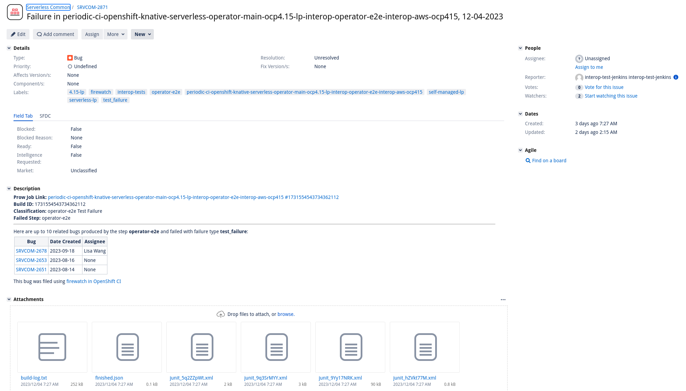

# Using the firewatch CLI

## Table of Contents

* [Using the firewatch CLI](#using-the-firewatch-cli)
  * [Installation](#installation)
    * [Docker (recommended)](#docker-recommended)
    * [Local Machine (using venv)](#local-machine-using-venv)
  * [Configuration](#configuration)
    * [Jira issue creation (`firewatch report`) configuration](#jira-issue-creation-firewatch-report-configuration)
      * [Defining the Configuration](#defining-the-configuration)
  * [Usage](#usage)
    * [`report`](#report)
    * [`jira_config_gen`](#jiraconfiggen)

## Installation

### Docker (recommended)

1. Ensure you have [Docker installed](https://www.docker.com/get-started/) on your system.
2. Clone the repository: `git clone https://github.com/CSPI-QE/firewatch.git`.
3. Navigate to the project root in your terminal: `cd firewatch`.
4. Run the following to build and run a Docker container with firewatch installed: `make build-run`.
5. Use the `firewatch` command to execute the tool. See the [CLI usage guide](docs/cli_usage_guide.md) for instructions on using the tool.

### Local Machine (using venv)

1. Clone the repository: `git clone https://github.com/CSPI-QE/firewatch.git`
2. Navigate to the project root: `cd firewatch`
3. Install the necessary dependencies: `make dev-environment`
4. Use the `firewatch` command to execute the tool. See the [CLI usage guide](docs/cli_usage_guide.md) for instructions on using the tool.

## Configuration

### Jira issue creation (`firewatch report`) configuration

Firewatch was designed to allow for users to define which Jira issues get created depending on which failures are found in a OpenShift CI failed run. Using an easy-to-define JSON config, users can easily track issues in their OpenShift CI runs efficiently.

**Example:**

```json
[
  {"step": "exact-step-name", "failure_type": "pod_failure", "classification": "Infrastructure", "jira_project": "PROJECT"},
  {"step": "*partial-name*", "failure_type": "all", "classification":  "Misc.", "jira_project": "OTHER"},
  {"step": "*ends-with-this", "failure_type": "test_failure", "classification": "Test failures", "jira_project": "TEST"},
  {"step": "*ignore*", "failure_type": "test_failure", "classification": "NONE", "jira_project": "NONE", ignore: "true"}
]
```

#### Defining the Configuration

The firewatch configuration is a list of rules, each rule is defined using 4 values:

- `step`: The exact or partial name of a step in OpenShift CI. Using this value, we can usually determine what may have gone wrong during an OpenShift CI run.
  - For example, say you have multiple steps whose names start with `infra-setup-` and you can confidently say that most of the time, if a run fails during one of these steps, it is probably an infrastructure setup issue. You can define a rule to always file a bug in a specific Jira project so the issue can be addressed. The value in this instance would be something like `infra-setup-*`.
  - The value of this key can be whatever you'd like and can shell-style wildcards in the definition of this key:
    - `*` – matches everything.
    - `?` – matches any single character.
- `failure_type`: The type of failure you'd like issues to be created for. Currently, there are 3 options for this value.
  - `pod_failure`: A failure where the code being executed in the step (OpenShift CI pod) returns a non-zero exit code (when the `passed` value in [`finished.json`](https://docs.prow.k8s.io/docs/metadata-artifacts/) is set to `false`)
  - `test_failure`: A failure where the code being executed in the step produces one or more JUnit files (must have `junit` in the filename) that is in the artifacts (copied into the `$ARTIFACT_DIR`) for the step and any failure is found in the JUnit file(s).
  - `all`: Either a `pod_failure` or a `test_failure`.
- `classification`: How you'd like to classify the issue in Jira. This is not a formal field in Jira, but will be included in the issue description. This is meant to act as a "best-guess" value for why the failure happened.
- `jira_project`: The Jira project you'd like the issue to be filed under.
- `ignore`[OPTIONAL]: A value that be set to "true" or "false" and allows the user to define `step`/`failure_type` combinations that should be ignored when creating tickets.

The firewatch configuration can be saved to a file (can be stored wherever you want and named whatever you want, it must be JSON though) or defined in the `FIREWATCH_CONFIG` variable. When using the [`report` command](#report---create-jira-issues), if an argument for `--firewatch_config_path` is not provided, the environment variable will be used.

## Usage

### `report`

The `report` command is used to generate and file Jira issues for a failed OpenShift CI run using a [user-defined firewatch configuration](#configuration).
Many of the arguments for this command have set defaults or will use an environment variable

**Pre-requisites:**

1. A Jira configuration file must exist. Use the `jira_config_gen` command to generate the configuration file.
2. A firewatch config must be defined. Use the [Configuration section above](#configuration) to generate your configuration.

**Arguments:**

```commandline
Usage: firewatch report [OPTIONS]

Options:
  --fail_with_test_failures     Firewatch will fail with a non-zero exit code
                                if a test failure is found.
  --jira_config_path TEXT       The path to the jira configuration file
                                [required]
  --firewatch_config_path TEXT  The path to the firewatch configuration file
  --gcs_bucket TEXT             The name of the GCS bucket that holds
                                OpenShift CI logs  [required]
  --build_id TEXT               The build ID that needs to be reported. The
                                value of $BUILD_ID
  --job_name_safe TEXT          The safe name of a test in a Prow job. The
                                value of $JOB_NAME_SAFE
  --job_name TEXT               The full name of a Prow job. The value of
                                $JOB_NAME
```

**Examples:**

```commandline
# Using all environment variables (Running in OpenShift CI uses this method)
$ export BUILD_ID="some_build_id"
$ export JOB_NAME_SAFE="some_safe_job_name"
$ export JOB_NAME="some_job_name"
$ export FIREWATCH_CONFIG="[{"step": "some-step-name","failure_type":"pod_failure", "classification": "some best guess classification", "jira_project": "PROJECT"}]"
$ firewatch report

# Using CLI arguments
$ firewatch report --build_id some_build_id --job_name_safe some_safe_job_name --job_name some_job_name --firewatch_config_path /some/path/to/firewatch_config.json

# Exit with a non-zero exit code if test failures are found in any JUnit file for a step
$ firewatch report --fail_with_test_failures

```

**Example of Jira Ticket Created:**



### `jira_config_gen`

The `jira_config_gen` command is used to generate the Jira configuration file used when firewatch interacts with a Jira server.

**Arguments:**

```commandline
Usage: firewatch jira_config_gen [OPTIONS]

Options:
  --output_file TEXT  Where the rendered config will be stored  [required]
  --token_path TEXT   Path to the Jira API token  [required]
  --server_url TEXT   Jira server URL, i.e "https://issues.stage.redhat.com"
                      [required]
  --help              Show this message and exit.
```

**Examples:**

```commandline
# Create a configuration file in the default location (/tmp/jira.config)
$ firewatch jira_config_gen --token_path {Path to file containing Jira API token} --server_url https://some.jira.server.com

# Create a configuration file in a different location (/some/path/jira.config)
$ firewatch jira_config_gen --token_path {Path to file containing Jira API token} --server_url https://some.jira.server.com --output_file /some/path
```
